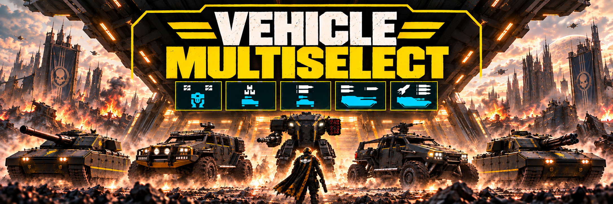

# Vehicle MultiSelect v0.12

By [Toritte](https://github.com/Toritte). Select different exosuits, FRVs and tanks together in Helldivers 2's standard four stratagem slots.

**No Bingus Shared Loader required.** Enable Exosuit, FRV and Tank independently in the mod manager, or combine them. The four-slot limit and vehicle unlock requirements remain unchanged. This mod does not allow duplicate copies of the same stratagem.

## Installation
1. Close the game.
2. Import the installable Vehicle MultiSelect ZIP into **Arsenal** or **Helldivers 2 Mod Manager**.

If you have installed **Bingus Shared Loader** made by [CowboyBingus](https://ayakamods.com/mods/bingus-shared-loader.3861/), **OU MUST PLACE THIS MOD FOLLOWING THE LOADER'S INSTRUCTION, OTHERWISE IT WOULD NOT WORK. THE LOADER ISN'T MANDATORY, BUT SUPPORT EXIST TO PREVENT INCOMPATIBLE ISSUES.**

Follow the loader's priority instructions. In Arsenal's default priority, put the loader last; **with reversed priority put it first.**

3. Open **EDIT**, check the vehicle categories you want, enable the mod and **Deploy**.
4. Start the game and select your vehicles. Restart the game after changing options.

## Uninstallation :
Close the game, You must fully close the game to uninstall the mod.
Disable this mod, purge OR deploy again then relaunch the game.

Four slots and unlock requirements remain unchanged. Selecting the same
stratagem multiple times is not supported for this mod this time.

## Options
| Option | Included vehicle records |
| --- | --- |
| Exosuit | Four exosuit variants |
| FRV | Three FRV variants |
| Tank | Bastion and Maelstrom |

Only vehicles available to your account can be selected. You still have four stratagem slots in total.

## Compatibility
Supports Steam build **25480438**. Game updates may require a mod update. User-confirmed working with HD2 HUD+ 0.1.12. This version leaves boot unchanged and replaces `core/wwise/lua/wwise_flow_callbacks`. Bingus is optional. Do not combine with earlier or separate MultiSelect packages. The shared loader is not required; compatibility with unrelated mods must be assessed separately.

## Documentation
[Build from source](CONTRIBUTING.md) · [Technical walkthrough](docs/TECHNICAL.md) · [Third-party notices](THIRD_PARTY.md) · [Release notes](docs/RELEASE_NOTES.md) · [Artwork](assets/ARTWORK.md)

## Credits and availability
Source and documentation are prepared for GitHub.

AI disclosure: OpenAI Codex assisted with research, implementation, debugging and documentation.
